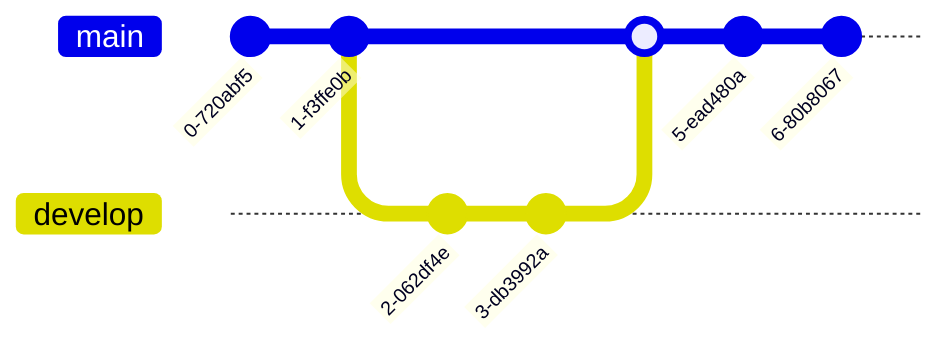

<svg version="1.1" id="Calque_1" xmlns="http://www.w3.org/2000/svg" xmlns:xlink="http://www.w3.org/1999/xlink" x="0px" y="0px"
     width="425.2px" height="99.21px" viewBox="0 0 425.2 99.21" enable-background="new 0 0 425.2 99.21" xml:space="preserve" stroke="white" stroke-width=".5%">
  <g>
    <g>

 <linearGradient id="bird_2_" gradientUnits="userSpaceOnUse" x1="3726.1963" y1="1102.499" x2="3726.1963" y2="1085.1249" gradientTransform="matrix(4.262 0 0 -4.262 -15526.0078 4711.7021)">
        <stop  offset="0.3006" style="stop-color:#57C2EB"/>
        <stop  offset="1" style="stop-color:#28B3E3"/>
      </linearGradient>
      <path id="bird_1_" fill="url(#bird_2_)" d="M301.279,66.168c6.994,6.469,24.949,12.588,39.561-1.734
        c-2.627,0.41-4.82-0.088-6.486-1.736c-1.582-1.566-1.668-3.186-0.822-4.66c0.688-1.197,2.137-2.043,3.562-2.924
        c-2.586,0.48-4.791,0.23-6.762-0.777c-2.645-1.352-5.217-2.775-5.938-5.709c1.617-1.701,3.416-3.223,7.309-2.65
        c-3.662-1.223-6.943-2.816-9.318-5.207c-2.314-2.328-2.555-3.839-2.924-5.665c2.02-0.749,4.133-1.138,6.395-0.914
        c-5.119-2.617-7.293-6.217-8.496-10.141c-0.363-1.185-0.428-2.314-0.275-3.472c20.74,7.829,30.453,13.454,35.814,18.73
        c2.412-6.419,8.037-20.958,16.445-25.948c0.041,0.792-0.275,1.646-0.914,2.559c2.49-1.387,4.434-3.606,7.857-3.563
        c-0.395,1.62-1.527,2.917-3.746,3.745c2.238-0.855,4.506-1.582,6.854-2.009c2.178-0.394,2.146,1.323,0.914,2.192
        c-2.502,1.764-5.158,1.984-7.768,2.832c7.998,0.2,14.535,3.985,19.643,12.243c1.697,2.744,2.838,5.488,3.107,8.496
        c3.412,0.959,6.807,1.154,10.232,0.549c0.939-0.166,1.814-0.342,2.65-0.73c-1.334,2-2.871,3.643-5.025,4.385
        c-2.059,0.711-4.121,1.404-6.395,1.463c3.703,1.402,7.781,1.479,11.969,1.188c-5.121,4.93-9.041,4.811-12.975,4.75
        c-1.725,7.283-5.25,14.547-12.699,21.197c-9.77,8.723-20.287,12.885-31.154,13.797c-10.189,0.854-20.037,0.736-30.791-4.295
        C313.133,78.428,306.451,73.293,301.279,66.168L301.279,66.168z"/>
      <g>
        <g>
          <linearGradient id="SVGID_1_" gradientUnits="userSpaceOnUse" x1="261.0098" y1="18.1694" x2="261.0098" y2="85.3524">
            <stop  offset="0.2699" style="stop-color:#57C3EC"/>
            <stop  offset="1" style="stop-color:#28B3E3"/>
          </linearGradient>
          <path fill="url(#SVGID_1_)" d="M261.033,57.682c-0.057,0.01-0.117,0.006-0.174,0.016l0.301-0.049
            C261.113,57.656,261.08,57.676,261.033,57.682z"/>
          <linearGradient id="SVGID_2_" gradientUnits="userSpaceOnUse" x1="37.896" y1="18.1694" x2="37.896" y2="85.3536">
            <stop  offset="0.2699" style="stop-color:#57C3EC"/>
            <stop  offset="1" style="stop-color:#28B3E3"/>
          </linearGradient>
          <path fill="url(#SVGID_2_)" d="M59.318,71.848c0,1.963-0.704,3.648-2.113,5.049C55.796,78.299,54.108,79,52.136,79H37.938
            c-5.915,0-10.97-2.09-15.168-6.275c-4.199-4.184-6.296-9.221-6.296-15.117V28.933c0-2.021,0.699-3.718,2.097-5.095
            c1.398-1.375,3.106-2.064,5.122-2.064c1.957,0,3.639,0.702,5.035,2.105c1.4,1.401,2.102,3.083,2.102,5.049v10.382h20.214
            c1.835,0,3.407,0.65,4.719,1.953c1.311,1.299,1.964,2.859,1.964,4.68c0,1.818-0.653,3.38-1.959,4.681
            c-1.306,1.299-2.875,1.952-4.702,1.952H30.829v5.025c0,1.971,0.688,3.645,2.071,5.025c1.381,1.377,3.058,2.066,5.031,2.066
            h14.202c1.971,0,3.663,0.703,5.072,2.105S59.318,69.885,59.318,71.848z"/>
          <linearGradient id="SVGID_3_" gradientUnits="userSpaceOnUse" x1="208.0547" y1="18.1694" x2="208.0547" y2="85.3536">
            <stop  offset="0.2699" style="stop-color:#57C3EC"/>
            <stop  offset="1" style="stop-color:#28B3E3"/>
          </linearGradient>
          <path fill="url(#SVGID_3_)" d="M225.602,71.848c0,1.963-0.705,3.648-2.113,5.049C222.08,78.299,220.393,79,218.42,79h-6.449
            c-5.914,0-10.969-2.09-15.168-6.275c-4.198-4.184-6.294-9.221-6.294-15.117V28.933c0-2.021,0.698-3.718,2.097-5.095
            c1.398-1.375,3.106-2.064,5.122-2.064c1.957,0,3.639,0.702,5.035,2.105c1.4,1.401,2.102,3.083,2.102,5.049v10.382h12.465
            c1.834,0,3.406,0.652,4.717,1.953c1.312,1.299,1.965,2.859,1.965,4.68c0,1.818-0.652,3.38-1.959,4.681
            c-1.305,1.299-2.875,1.95-4.701,1.95h-12.486v5.027c0,1.971,0.688,3.645,2.07,5.025c1.381,1.377,3.059,2.066,5.031,2.066h6.453
            c1.969,0,3.662,0.703,5.07,2.105S225.602,69.885,225.602,71.848z"/>
          <linearGradient id="SVGID_4_" gradientUnits="userSpaceOnUse" x1="170.5181" y1="18.1694" x2="170.5181" y2="85.3536">
            <stop  offset="0.2699" style="stop-color:#57C3EC"/>
            <stop  offset="1" style="stop-color:#28B3E3"/>
          </linearGradient>
          <path fill="url(#SVGID_4_)" d="M188.065,71.848c0,1.963-0.705,3.648-2.113,5.049c-1.408,1.402-3.096,2.104-5.068,2.104h-6.449
            c-5.915,0-10.97-2.09-15.167-6.275c-4.198-4.184-6.295-9.221-6.295-15.117V28.933c0-2.021,0.699-3.718,2.097-5.095
            c1.398-1.375,3.105-2.064,5.122-2.064c1.956,0,3.639,0.702,5.034,2.105c1.4,1.401,2.102,3.083,2.102,5.049v10.382h12.465
            c1.835,0,3.407,0.652,4.717,1.953c1.312,1.299,1.965,2.859,1.965,4.68c0,1.818-0.652,3.38-1.959,4.681
            c-1.305,1.299-2.875,1.95-4.701,1.95h-12.487v5.027c0,1.971,0.688,3.645,2.071,5.025c1.381,1.377,3.058,2.066,5.03,2.066h6.453
            c1.97,0,3.663,0.703,5.071,2.105S188.065,69.885,188.065,71.848z"/>
          <linearGradient id="SVGID_5_" gradientUnits="userSpaceOnUse" x1="95.1538" y1="18.1689" x2="95.1538" y2="85.3536">
            <stop  offset="0.2699" style="stop-color:#57C3EC"/>
            <stop  offset="1" style="stop-color:#28B3E3"/>
          </linearGradient>
          <path fill="url(#SVGID_5_)" d="M128.546,58.986c0,5.516-1.961,10.23-5.888,14.145C118.733,77.043,114.005,79,108.474,79
            c-5.06,0-9.512-1.705-13.359-5.119C91.321,77.295,86.894,79,81.835,79c-5.53,0-10.261-1.957-14.188-5.869
            c-3.925-3.914-5.887-8.629-5.887-14.145V45.008c0-1.893,0.657-3.479,1.976-4.766c1.313-1.289,2.895-1.932,4.736-1.932
            c1.845,0,3.424,0.643,4.738,1.932c1.316,1.287,1.975,2.877,1.975,4.77v13.984c0,1.844,0.646,3.404,1.935,4.693
            c1.292,1.289,2.861,1.93,4.705,1.93c1.792,0,3.333-0.641,4.624-1.93c1.291-1.289,1.935-2.85,1.935-4.693V45.09
            c0-1.84,0.662-3.428,1.979-4.77c1.322-1.338,2.933-2.01,4.832-2.01c1.845,0,3.428,0.657,4.749,1.973
            c1.321,1.312,1.98,2.891,1.98,4.729v13.984c0,1.844,0.646,3.404,1.937,4.693c1.289,1.289,2.833,1.93,4.623,1.93
            c1.845,0,3.414-0.641,4.702-1.93c1.292-1.289,1.937-2.85,1.937-4.693V45.012c0-1.838,0.659-3.416,1.976-4.729
            c1.315-1.316,2.896-1.973,4.736-1.973c1.844,0,3.425,0.657,4.739,1.969c1.316,1.312,1.974,2.889,1.974,4.729V58.986z"/>
          <linearGradient id="SVGID_6_" gradientUnits="userSpaceOnUse" x1="140.7593" y1="18.1694" x2="140.7593" y2="85.3524">
            <stop  offset="0.2699" style="stop-color:#57C3EC"/>
            <stop  offset="1" style="stop-color:#28B3E3"/>
          </linearGradient>
          <path fill="url(#SVGID_6_)" d="M147.936,27.367c0,1.962-0.702,3.646-2.111,5.048c-1.408,1.402-3.096,2.105-5.064,2.105
            c-1.973,0-3.66-0.703-5.069-2.105c-1.404-1.401-2.108-3.086-2.108-5.048c0-1.965,0.704-3.647,2.108-5.049
            c1.409-1.404,3.097-2.104,5.069-2.104c1.969,0,3.657,0.7,5.064,2.104C147.234,23.719,147.936,25.402,147.936,27.367z"/>
          <linearGradient id="SVGID_7_" gradientUnits="userSpaceOnUse" x1="140.7593" y1="18.1689" x2="140.7593" y2="85.3536">
            <stop  offset="0.2699" style="stop-color:#57C3EC"/>
            <stop  offset="1" style="stop-color:#28B3E3"/>
          </linearGradient>
          <path fill="url(#SVGID_7_)" d="M147.936,71.84c0,1.967-0.702,3.652-2.111,5.055C144.417,78.299,142.729,79,140.76,79
            c-1.973,0-3.66-0.701-5.069-2.105c-1.404-1.402-2.108-3.088-2.108-5.055V45.471c0-1.967,0.704-3.652,2.108-5.055
            c1.409-1.404,3.097-2.106,5.069-2.106c1.969,0,3.657,0.702,5.064,2.106c1.409,1.402,2.111,3.088,2.111,5.055V71.84z"/>
          <linearGradient id="SVGID_8_" gradientUnits="userSpaceOnUse" x1="292.7744" y1="18.168" x2="292.7744" y2="85.3534">
            <stop  offset="0.2699" style="stop-color:#57C3EC"/>
            <stop  offset="1" style="stop-color:#28B3E3"/>
          </linearGradient>
          <path fill="url(#SVGID_8_)" d="M310.957,45.945c0,1.82-0.654,3.38-1.963,4.683c-1.307,1.299-2.875,1.95-4.703,1.95h-9.801
            c-1.83,0-3.385,0.639-4.666,1.916c-1.283,1.275-1.92,2.826-1.92,4.652v13.209c0,1.822-0.652,3.389-1.957,4.689
            c-1.307,1.307-2.871,1.955-4.699,1.955c-1.826,0-3.393-0.648-4.697-1.953c-1.307-1.301-1.959-2.863-1.959-4.688V59.156
            c0-5.469,1.945-10.143,5.838-14.023c3.893-3.879,8.584-5.822,14.07-5.822h9.793c1.83,0,3.396,0.652,4.703,1.953
            S310.957,44.125,310.957,45.945z"/>
          <linearGradient id="SVGID_9_" gradientUnits="userSpaceOnUse" x1="248.8672" y1="18.1689" x2="248.8672" y2="85.3535">
            <stop  offset="0.2699" style="stop-color:#57C3EC"/>
            <stop  offset="1" style="stop-color:#28B3E3"/>
          </linearGradient>
          <path fill="url(#SVGID_9_)" d="M248.068,79c-5.648,0-10.971-2.146-15.17-6.438c-4.197-4.295-5.809-8.971-5.809-15.021
            c0,0-0.41-19.241,21.35-19.241c17.025,0,22.207,11.959,22.207,17.864c0,4.693-2.146,6.359-7.033,6.359h-21.76
            c0,0-0.787,4.979,9.125,4.979h12.418c3.176,0,5.748,2.574,5.748,5.75c0,3.174-2.572,5.748-5.748,5.748H248.068z M241.998,53.357
            h14.287c0-4.695-7.105-4.695-7.105-4.695S241.998,48.662,241.998,53.357z"/>
        </g>
      </g>
      
   </g>

  </g>
  </svg>


[FONT - mksd.jp/poco.html - @X @nasa-jpl @blackgirlscode](https://mksd.jp/poco.html)


[FONT - mksd.jp/honey.html - @X @nasa-jpl @blackgirlscode](https://mksd.jp/honey.html)


[FONT - mksd.jp/pico.html - @X @nasa-jpl @blackgirlscode](https://mksd.jp/pico.html)


```xml
  <?xml version="1.0" encoding="utf-8"?>
 
  <!DOCTYPE svg PUBLIC "-//W3C//DTD SVG 1.1//EN" "http://www.w3.org/Graphics/SVG/1.1/DTD/svg11.dtd">
```


[mermaid.ai/open-source/syntax/examples.html#a-commit-flow-diagram](https://mermaid.ai/open-source/syntax/examples.html#a-commit-flow-diagram) 

<div class="mermaid">
gitGraph:
    commit "Ashish"
    branch newbranch
    checkout newbranch
    commit id:"1111"
    commit tag:"test"
    checkout main
    commit type: HIGHLIGHT
    commit
    merge newbranch
    commit
    branch b2
    commit
</div>




[Queen Latifah Opens Up About a Private Battle - Red Table Talk @foratlanta](https://www.youtube.com/watch?v=vgn4y83wXJg)


# HTML
[HTML Living Standard](https://html.spec.whatwg.org/multipage/) — Last Updated 3 July 2026 [@mdn](https://github.com/mdn)
[ColorNAmes - w3schools.com](https://www.w3schools.com/tags/ref_colornames.asp)
[https://fonts.google.com/](https://fonts.google.com/) @adobe i hope u guys are ok [I was looking for kuler.adobe.com/ functionality](http://web.archive.org/web/20250212005944/https://kuler.adobe.com/) and i know abt [color.adobe.com](color.adobe.com) for making swatches but the hex values are missing like the tool was downgraded and ad poisoned and i know that can be a sign of cyber attack @cisagov @fbicyber @nasa-jpl @whitehouse @deptofwar [color.adobe.com](https://color.adobe.com/) 


<div class="tupperware" markdown="1">
	
[<video controls src="https://archive.org/download/longbeach_202605/000_SPACEBEACH_GoogleFontInstallForVirtiservBaeLAtriceRecording%202026-07-03%20121238.mp4" />](https://archive.org/download/longbeach_202605/000_SPACEBEACH_GoogleFontInstallForVirtiservBaeLAtriceRecording%202026-07-03%20121238.mp4)

[<video controls src="https://archive.org/download/vid-20260411-163609-170/BuiltInWebFontsForSLoadingSpeedAndReducedVurnalbility_VirtiserLanaLatriceHArissKarenBASSRecording%202026-07-03%20SPACEBEACH_WEB_DEV_Rex152229.mp4" />](https://archive.org/download/vid-20260411-163609-170/BuiltInWebFontsForSLoadingSpeedAndReducedVurnalbility_VirtiserLanaLatriceHArissKarenBASSRecording%202026-07-03%20SPACEBEACH_WEB_DEV_Rex152229.mp4)

</div>

[codepen.io/_`RashardKElly`_/pen/jEyaRGj](https://codepen.io/RashardKElly/pen/jEyaRGj)
[codepen.io/thakarashard/pen/LYdgvbd](https://codepen.io/thakarashard/pen/LYdgvbd)


[ codepen.io/thakarashard/pen/XWExReO](https://codepen.io/thakarashard/pen/XWExReO)


[codepen.io/thakarashard/pen/yLKxPXy](https://codepen.io/thakarashard/pen/yLKxPXy)


# CSS Attribute selectors
The CSS attribute selector matches elements based on the element having a given attribute explicitly set, with options for defining an attribute value or substring value match. [@mdn read](https://developer.mozilla.org/en-US/docs/Web/CSS/Reference/Selectors/Attribute_selectors) @blackgirlscode 

```css
/* <a> elements with a title attribute */
a[title] {
  color: purple;
}

/* <a> elements with an href matching "https://example.org" */
a[href="https://example.org"] {
  color: green;
}

/* <a> elements with an href containing "example" */
a[href*="example"] {
  font-size: 2em;
}

/* <a> elements with an href ending ".org", case-insensitive */
a[href$=".org" i] {
  font-style: italic;
}

/* <a> elements whose class attribute contains the word "logo" */
a[class~="logo"] {
  padding: 2px;
}
```

@nasa-jpl code review @nasa-pds 
[@mdn](https://developer.mozilla.org/en-US/docs/Web/CSS/Guides/Selectors)
/* if you use the alt tag you can apply style to images by alt tag text assignment */

```css
  img[src*="Mars_Reconnaissance_Orbiter_insignia.png"] {width: 25%;padding: 4px;float: left;}
  img[src*="Logo_of_the_United_States_Space_Force.png"] {width: 188px;padding: 4px;float: right;}
/* img[src*="Mars_Reconnaissance_Orbiter_insignia.png"] {max-width: 250px;padding: 4px;float: right;} */
img[alt="whiteslavery"] {
  max-width: 15%;
  float: right;
}


img[alt="whiteslavery40"] {
  max-width: 40%;
  transform: rotate(45deg);
}
img[src*="Midway_Games_logo"] {background: transparent
  url(https://raw.githubusercontent.com/ThakaRashard/bubblegumpop/gh-pages/img/halfscreen-white.gif)
  center repeat; width: 100%;}
img[src*="6071cc4b982fd393d892490ed7a702738c595099"] {background: transparent
  url(https://raw.githubusercontent.com/ThakaRashard/bubblegumpop/gh-pages/img/halfscreen-white.gif)
  center repeat; width: 100%;}
  img[src*="859740137800_cover.jpg/1200x1200bf-60.jpg"] {width: 25%; border: 5px solid #003da550;}
img[src*="workflows/ci.yaml/badge.svg"] {width: min-content;}
img[src*="https://badge.fury.io"] {width: min-content;}
img[src*="img.shields.io/badge/Social-ricoThaka"] {width: 15%;}
```


# MathJax : [demo](https://mathjax.github.io/MathJax-demos-web/page/tex-chtml.html)
 [https://mathjax.github.io/MathJax-demos-web/](https://mathjax.github.io/MathJax-demos-web/) 
 @nasa-pds @cityoflosangeles [talk.jekyllrb.com/t/jekyll-and-mathjax-how-to-configure-specific-inline-and-display-math/9551/8](https://talk.jekyllrb.com/t/jekyll-and-mathjax-how-to-configure-specific-inline-and-display-math/9551/8) // [talk.jekyllrb.com/t/jekyll-and-mathjax/5514/2](https://talk.jekyllrb.com/t/jekyll-and-mathjax/5514/2)
 
<p>
  When $a \ne 0$, there are two solutions to \(ax^2 + bx + c = 0\) and they are
  $$x = {-b \pm \sqrt{b^2-4ac} \over 2a}.$$
</p>

<h2>The Lorenz Equations</h2>

<p>
  \begin{align}
    \dot{x} & = \sigma(y-x) \\
    \dot{y} & = \rho x - y - xz \\
    \dot{z} & = -\beta z + xy
  \end{align}
</p>

<h2>The Cauchy-Schwarz Inequality</h2>

<p>\[
  \left( \sum_{k=1}^n a_k b_k \right)^{\!\!2} \leq
  \left( \sum_{k=1}^n a_k^2 \right) \left( \sum_{k=1}^n b_k^2 \right)
 \]</p>

 <h2>A Cross Product Formula</h2>

 <p>\[
   \mathbf{V}_1 \times \mathbf{V}_2 =
     \begin{vmatrix}
       \mathbf{i} & \mathbf{j} & \mathbf{k} \\
       \frac{\partial X}{\partial u} & \frac{\partial Y}{\partial u} & 0 \\
       \frac{\partial X}{\partial v} & \frac{\partial Y}{\partial v} & 0 \\
     \end{vmatrix}
\]</p>

<h2>The probability of getting \(k\) heads when flipping \(n\) coins is:</h2>

<p>\[P(E) = {n \choose k} p^k (1-p)^{ n-k} \]</p>

<h2>An Identity of Ramanujan</h2>

<p>\[
  \frac{1}{\left(\sqrt{\phi \sqrt{5}}-\phi\right) e^{\frac25 \pi}} =
    1 + \dfrac{e^{-2\pi}}{
      1 + \dfrac{e^{-4\pi}}{
        1 + \dfrac{e^{-6\pi}}{
          1 + \dfrac{e^{-8\pi}}{1+\ldots}
        }
      }
    }
\]</p>

<h2>A Rogers-Ramanujan Identity</h2>

<p>\[
  1 + \frac{q^2}{(1-q)}+\frac{q^6}{(1-q)(1-q^2)}+\cdots =
    \prod_{j=0}^{\infty}\frac{1}{(1-q^{5j+2})(1-q^{5j+3})},
     \quad\quad \text{for $|q| < 1$}.
\]</p>

<h2>Maxwell's Equations</h2>

<p>
  \begin{align}
    \nabla \times \vec{\mathbf{B}}\, - \frac{1}{c}\, \frac{\partial\vec{\mathbf{E}}}{\partial t}
       & = \frac{4\pi}{c}\vec{\mathbf{j}} \\[3pt]
    \nabla \cdot \vec{\mathbf{E}} & = 4 \pi \rho \\[3pt]
    \nabla \times \vec{\mathbf{E}}\, + \frac{1}{c}\, \frac{\partial\vec{\mathbf{B}}}{\partial t}
        & = \vec{\mathbf{0}} \\[3pt]
    \nabla \cdot \vec{\mathbf{B}} & = 0
  \end{align}
</p>

<h2>In-line Mathematics</h2>

<p>Finally, while display equations look good for a page of samples, the
ability to mix math and text in a paragraph is also important.  This
expression $\sqrt{3x-1}+(1+x)^2$ is an example of an inline equation.  As
you see, MathJax equations can be used this way as well, without unduly
disturbing the spacing between lines.</p>
## Further reading

* [The MathJax website](http://mathjax.org)
* [Getting started with writing and formatting on GitHub](/en/get-started/writing-on-github/getting-started-with-writing-and-formatting-on-github)
* [GitHub Flavored Markdown Spec](https://github.github.com/gfm/)

# Mermaid Sequence Diagram: Blogging app service communication

<div class="mermaid">
sequenceDiagram
    participant web as Web Browser
    participant blog as Blog Service
    participant account as Account Service
    participant mail as Mail Service
    participant db as Storage

    Note over web,db: The user must be logged in to submit blog posts
    web->>+account: Logs in using credentials
    account->>db: Query stored accounts
    db->>account: Respond with query result

    alt Credentials not found
        account->>web: Invalid credentials
    else Credentials found
        account->>-web: Successfully logged in

        Note over web,db: When the user is authenticated, they can now submit new posts
        web->>+blog: Submit new post
        blog->>db: Store post data

        par Notifications
            blog--)mail: Send mail to blog subscribers
            blog--)db: Store in-site notifications
        and Response
            blog-->>-web: Successfully posted
        end
    end

</div>

# Water CoolEr 
<div class="mermaid">
sequenceDiagram
Alice ->> Bob: Hello Bob, how are you?
Bob-->>John: How about you John?
Bob--x Alice: I am good thanks!
Bob-x John: I am good thanks!
Note right of John: Bob thinks a long<br/>long time, so long<br/>that the text does<br/>not fit on a row.
Bob-->Alice: Checking with John...
Alice->John: Yes... John, how are you?
</div> 

# [Server Procurement Takes Too Long: Causes and Effects](https://github.com/rudolfolah/mermaid-diagram-examples/blob/main/diagrams/cause-and-effect.md)
<div class="mermaid">
mindmap
root{{Server Procurement Takes Too Long}}
  (Material)
    not sure what hardware requirements to use as a baseline
    obsolete hardware specifications
    high demand for specific hardware components
  (Vendors)
    convoluted, slow billing process
    limited vendor options
    long lead times for hardware delivery
    inconsistent communication from vendors
  (People)
    too many approvals required
    unclear when costs for server are passed to client
    client is unwilling to procure server
      budget unavailable until milestone is met
      does not see the need for the server
      already has on premises servers
      client does not want to use public cloud infrastructure
    lack of dedicated procurement personnel
    miscommunication between teams
  (Systems)
    procurement is not automated
    outdated procurement software
    lack of integration between procurement and project management tools
    manual tracking of procurement status
</div>

# Class Diagram 

<div class="mermaid">
---
title: Django Watson Class Diagram
---
classDiagram
class SearchAdapter {
  fields
  exclude
  store
  __init__(model)
  prepare_content(content)
  get_title(obj)
  get_description(obj)
  get_content(obj)
  get_url(obj)
  get_meta(obj)
  serialize_meta(obj)
  deserialize_meta(obj)
  get_live_queryset()
}

class SearchContextManager {
  _stack
  __init__()
  is_active()
  start()
  add_to_context(engine, obj)
  invalidate()
  is_invalid()
  end()
  update_index()
  skip_index_update()
}

class SearchContext {
  __init__(context_manager)
  __enter__()
  __exit__(exc_type, exc_value, traceback)
  __call__(func)
}

class SkipSearchContext {
  __exit__(exc_type, exc_value, traceback)
}

class SearchEngine {
  list _created_engines$
  dict _registered_models
  str _engine_slug
  SearchContextManager _search_context_manager
  get_created_engines()$ list
  __init__(engine_slug, search_context_manager)
  is_registered(model) bool
  register(model, adapter_cls, **field_overrides)
  unregister(model)
  get_registered_models() list
  get_adapter(model) SearchAdapter
  cleanup_model_index(model)
  update_obj_index(obj)
  _post_save_receiver(instance, **kwargs)
  _pre_delete_receiver(instance, **kwargs)
  _create_model_filter(models, backend) list
  _get_included_models(models) iter
  search(search_text, models, exclude, ranking, backend_name) Queryset
  filter(queryset, search_text, ranking, backend_name) Queryset
}

Exception <|-- SearchAdapterError
Exception <|-- SearchEngineError
Exception <|-- SearchContextError
SearchEngineError <|-- RegistrationError
SearchContextManager *-- SearchContext
SearchContext <|-- SkipSearchContext

</div>


[codepen.io/ricoThaka/pen/GgRdwGd](https://codepen.io/ricoThaka/pen/GgRdwGd)

